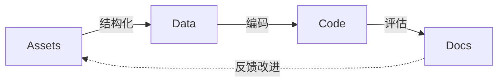

# 商务拓展域路线图

## 总管线



**核心循环**：每一步检验上一步的输出是否足够清晰。如果卡住，说明上游材料有改进空间。

---

## 步骤一：准备资产（Assets）

**目标**：集中所有和报价相关的源材料到 `assets/` 文件夹。

| # | 任务 | 输入 | 产出 |
|---|------|------|------|
| 1.1 | 收集章程中报价相关条款 | docs/bylaw | `assets/bylaw.md` |
| 1.2 | 收集手册中报价操作流程 | docs/handbook | `assets/handbook.md` |
| 1.3 | 收集教程中报价教学案例 | docs/tutorial | `assets/tutorial.md` |
| 1.4 | 收集报价规则 | docs/profile | `assets/profile/*.md` |
| 1.5 | 标注每份资产的模糊点 | 上述材料 | `docs/asset.md` |

**验收标准**：
- [ ] 报价相关的章程条款已完整提取
- [ ] 报价操作流程可追溯到手册原文
- [ ] 模糊点清单已记录，每项标注了具体位置和疑问

---

## 步骤二：结构化资产（Data）

**目标**：从 `assets/` 提取关键信息，用 YAML/JSON 存入 `data/` 文件夹。

| # | 任务 | 输入 | 产出 |
|---|------|------|------|
| 2.1 | 识别报价业务实体（客户、项目、服务项、价格、折扣、税率等） | 步骤一产出 | `data/schema.yaml`（实体关系定义） |
| 2.2 | 定义每项规则的可编码性条件 | 步骤一产出 | `data/rules.yaml`（规则→代码条件映射） |
| 2.4 | 验证数据完整性（是否有字段无法从资产中找到对应？） | 上述产出 | `docsverification.md` |

**验收标准**：
- [ ] schema 覆盖报价全流程（客户信息→服务项→价格计算→折扣→总价）
- [ ] 每项规则明确标注了"可直接编码"或"需改进文本"
- [ ] 至少 3 份历史报价已转换为结构化数据
- [ ] 无法映射的字段已记录到 `docs/feedback.md`

**规则可编码性条件示例**：

```yaml
rules:
  - name: 标准服务项定价
    source: handbook-quotation.md#第3节
    codifiable: true
    condition: 定价公式是确定性的，无主观判断
  - name: 折扣审批阈值
    source: bylaw-quotation.md#第5条
    codifiable: true
    condition: 阈值为明确数值，无歧义
  - name: 客户信用评估
    source: handbook-quotation.md#第7节
    codifiable: false
    reason: "评估标准使用了'通常''一般'等模糊表述，需改进"
```

---

## 步骤三：编码实现（Code）

**目标**：将可编码的规则用 Python 实现，输出到 `src/` 文件夹。

| # | 任务 | 输入 | 产出 |
|---|------|------|------|
| 3.1 | 实现报价计算引擎（服务项×单价×数量 + 折扣 + 税） | `data/rules.yaml` | `src/calculator.py` |
| 3.4 | 集成测试：用 `data/samples/*.yaml` 验证计算结果 | 上述产出 | `tests/test_quotation.py` |
| 3.5 | 记录编码过程中发现的模糊点 | 上述过程 | `docs/findings.md` |

**验收标准**：
- [ ] 报价计算引擎可对结构化数据输出正确报价单
- [ ] 折扣规则逻辑与手册一致
- [ ] 审批流程判断与章程一致
- [ ] 测试通过率 100%
- [ ] 编码过程中发现的每项模糊点已记录出处和建议

---

## 步骤四：评估与反馈（Docs）

**目标**：为规则清晰度打分，输出评估报告到 `docs/`，驱动上游改进。

| # | 任务 | 输入 | 产出 |
|---|------|------|------|
| 4.1 | 为每项规则的可编码性打分（1-5 分） | 步骤二/三产出 | `docs/clarity-scores.md` |
| 4.2 | 编写文档改进建议（指向章程/手册的具体章节） | 步骤三 `findings.md` | `docs/feedback.md` |
| 4.3 | 生成实验报告（做了什么、学到了什么、下一步） | 全部产出 | `docs/experiment-report.md` |
| 4.4 | 撰写总结报告 docs/index.md

**评分标准**：

| 分数 | 含义 | 示例 |
|------|------|------|
| 5 | 直接可编码 | "折扣率：满 10 万减 5%" |
| 4 | 微调后可编码 | "折扣率：满 10 万减 5%，特殊客户可申请额外折扣"（需明确"特殊客户"定义） |
| 3 | 需补充信息 | "折扣率：根据客户等级确定"（等级定义在别处） |
| 2 | 模糊，需重写 | "折扣率：适当优惠" |
| 1 | 无法编码 | "折扣率：视情况而定" |

---

## 总验收标准

- [ ] 管线完整跑通：Assets → Data → Code → Docs
- [ ] 至少一轮反馈闭环：编码发现的问题已提交 Issue
- [ ] 可重复：另一人按此路线图可独立复现
- [ ] 可扩展：路线图经验可用于其他职能域
